{ align=right }

Each Workspace ONE UEM tenant provides an API/help page that displays all the API commands, parameters and usage, as well as a mechanism to test each call. 

Omnissa has recently introduced a comprehensive Postman collection for Workspace ONE UEM. This collection includes all available API calls, pre-configured and ready to use, significantly improving workflow efficiency.

## Getting Started with Workspace ONE UEM API Postman Collection

The best part about this new Postman collection is how easy it is to get started. In just five minutes, you can fork the collection in your own workspace in Postman, setup environment variables, and begin testing APIs. This efficiency boost allows you to focus more on development and less on setup, driving faster innovation and more reliable implementations.

### Create Fork from Existing Collection
The first step is to create a fork of the original collection so that you can make the necessary changes for our own environment.

1. In Postman, navigate to the Workspace ONE UEM APIs workspace.  
   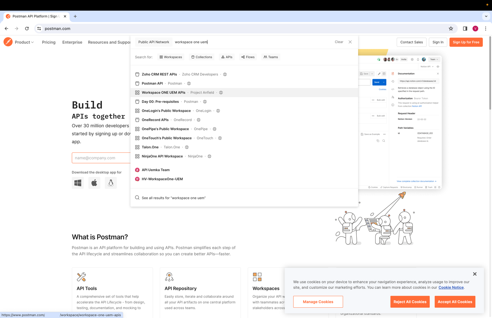
2. Click the three dots next to the parent folder and select **Create a Fork**.  
   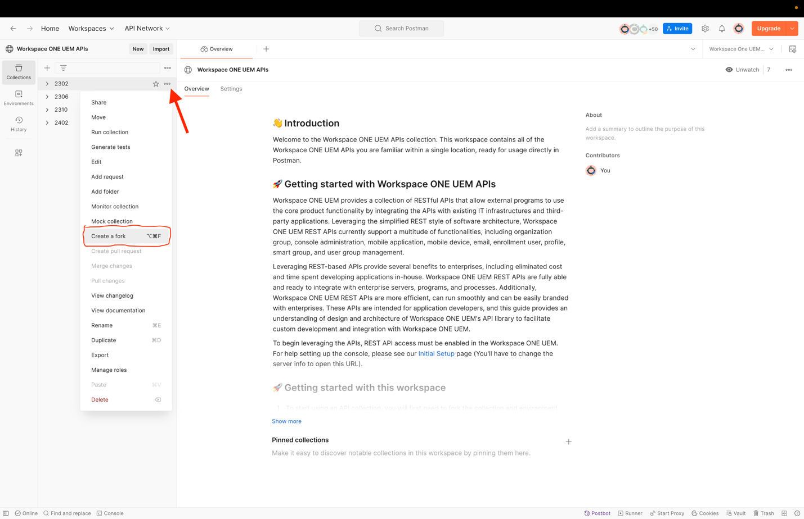
3. Make sure to include the Workspace ONE UEM API environment. It has placeholders for the variables like Oauth client credentials pre-configured.  
   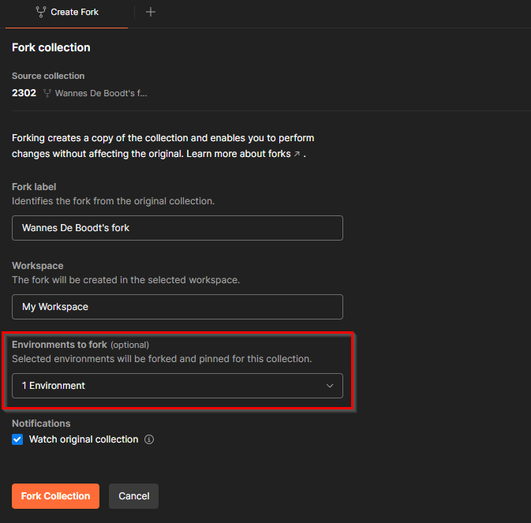
4. Once the fork has been created, switch to the Workspace ONE UEM environment in the upper-right corner.  
   
5. On the left side of the Postman UI, select variables and open the newly created Workspace ONE UEM environment. You can see a few variables that will be used by the API collection.  
   

### Collect Environment Variable Values
Before making the first API call, you must collect these five items:

- aw-tenant-code (API key)
- REST API URL
- Oauth token URL
- Oauth client ID
- Oauth client secret

#### aw-tenant-code and REST API URL

To get these first two values, follow these steps:

1. In the Workspace ONE UEM admin console, navigate to **Groups and Settings** > **All Settings** > **System** > **Advanced** > **API** > **Rest API**. Make sure you’re in Customer OG or below.
2. Copy the API key and hostname part of the REST API URL (e.g. as2060).  
   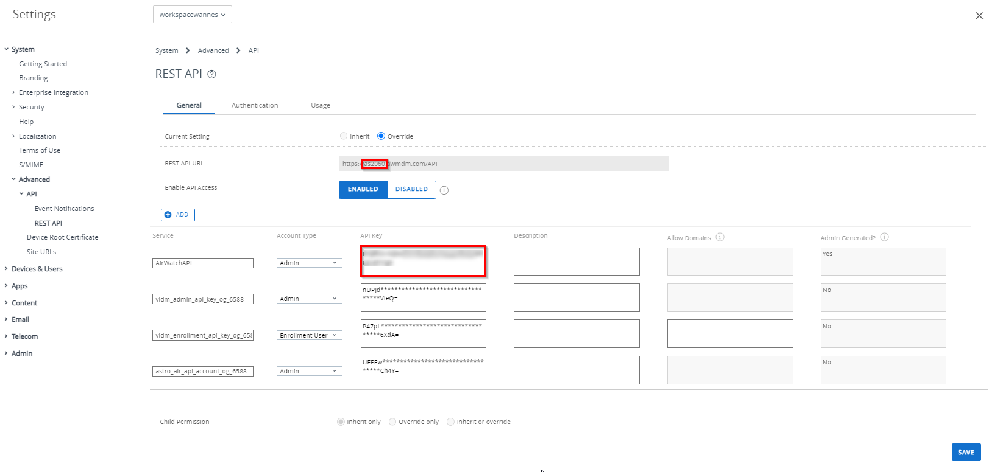
3. Back in Postman, add these values in the environment variables section:
   1. YOUR_API_SERVER
   2. Aw-tenant-code  
   

#### OAuth token URL

See the [Datacenter and Token URLs](https://docs.omnissa.com/bundle/WorkspaceONE-UEM-Console-BasicsVSaaS/page/UsingUEMFunctionalityWithRESTAPI.html#datacenter_and_token_urls_for_oauth_20_support) KB and copy the Token URL for your region.

**Note:** You might also want to create a dedicated REST API admin role for your environment, which is described in that same article. The example in this brief guide does not cover a dedicated REST API admin role, and uses the console admin role instead.

#### OAuth client ID and client secret

In Workspace ONE UEM admin console, follow these steps.

1. Navigate to **Group & Settings** > **Configurations** > **OAUTH client management** and click **Add**.  
   
   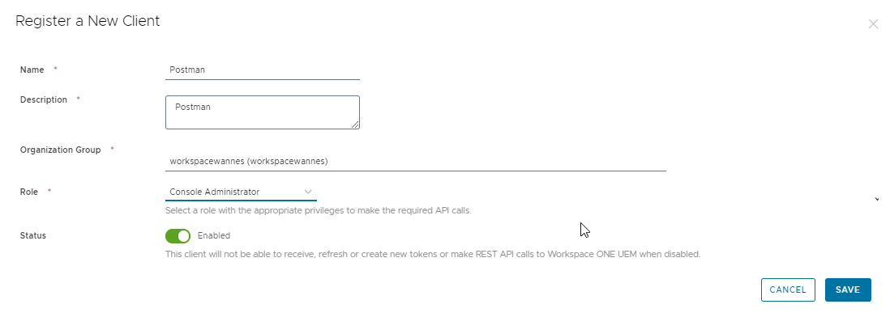
2. Copy the client ID and secret to a text file.  
   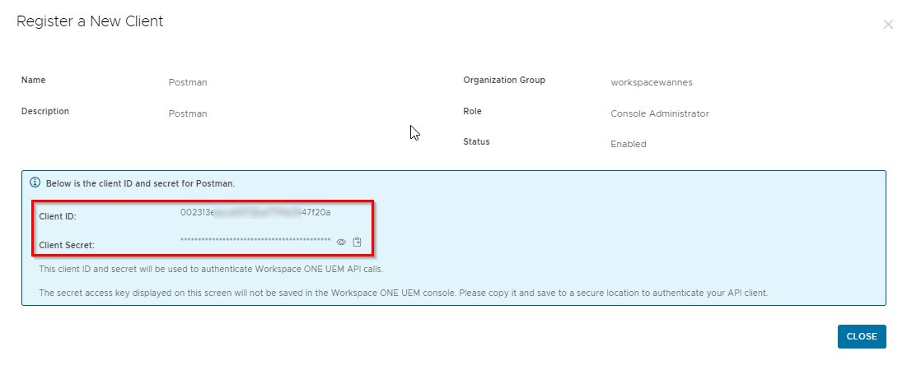
   
   Finally, you must obtain a fresh API token.
3. On the Authorization tab of the parent folder, scroll down and click **Get new access token**.  
   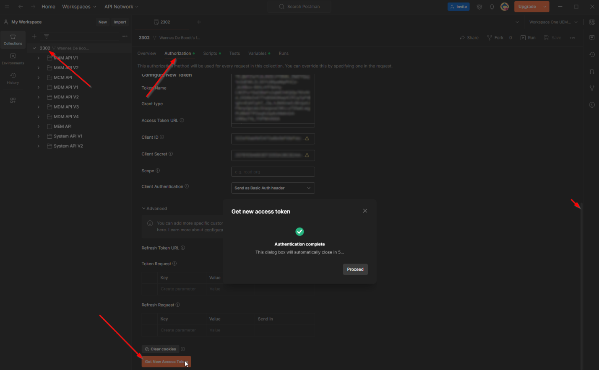

Now that you have successfully authenticated to Workspace ONE UEM, you have unlocked the access to all the API calls included in the collection.

### Real-World Example: Find Devices and Apply Tag

Let's see how to achieve this simple goal without touching the UEM console: find Windows devices for user Wannes and apply a tag to those devices. 

First, start with a request that returns the devices you are looking for. The API call `{{baseUrl}}/mdm/devices/`search sounds like the correct one.

To find out the purpose of a specific API call, see the documentation section. You will find a short description and additional details for mandatory and optional parameters.
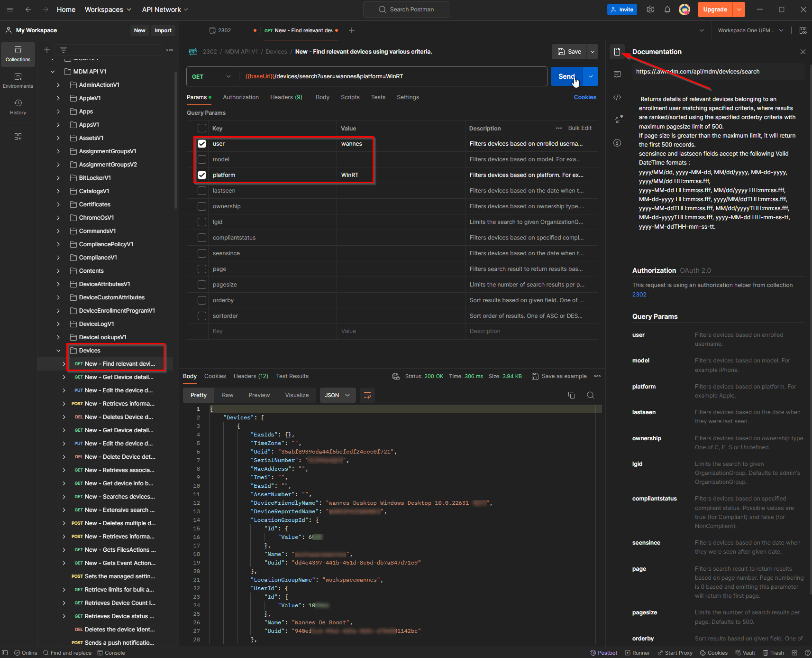

1. Copy the values of the `LocationGroupId` and device `Id` (located near the end) attributes in the response body, you will use these values later.
2. The next step would be to obtain the available tags from UEM. This requires the following API: `{{baseUrl}}/system/groups/:id/tags`, which is located under System API V1 > Tags.
   In the documentation section of this API, the PATH variable mentioned is mandatory, so the Organization Group ID value obtained with the previous call needs to be added to the Params tab.  
   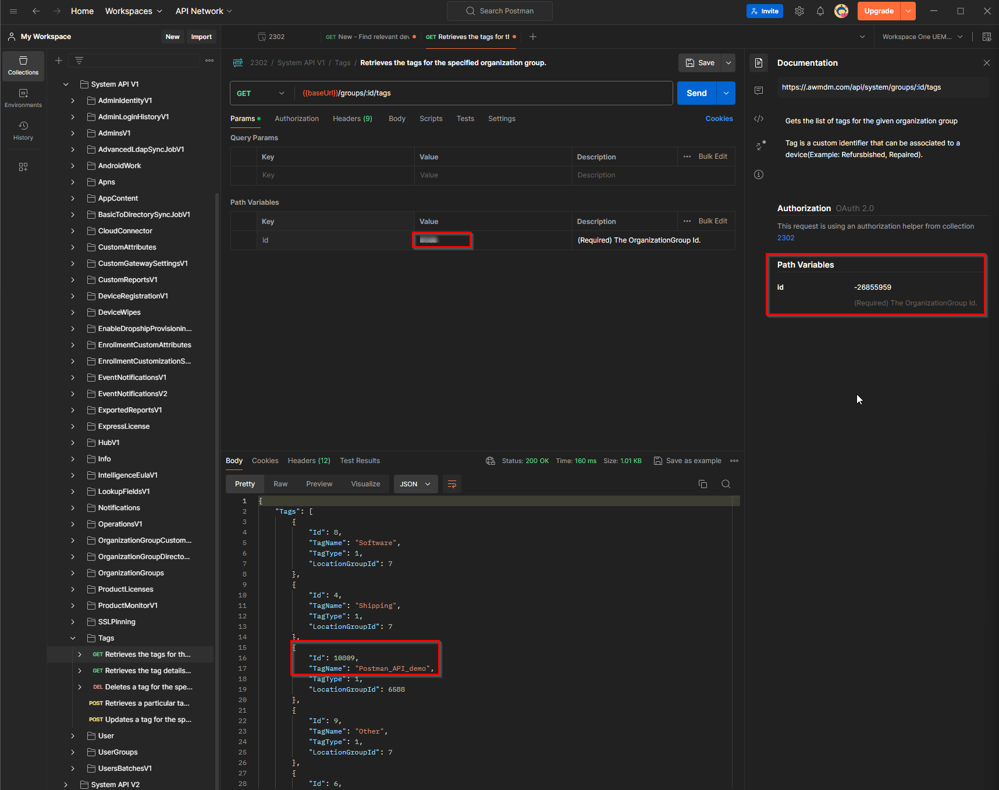
3. In the response body, you will find the available tags for the given Organization Group. Note down the Id value of the tag, you will need it for the final API call to assign a tag.
   Lastly, execute the API call that applies the selected tag to the device, using `{{baseUrl}}/mdm/tags/:tagid/`adddevices, located in MDM API V1 > Tags.
4. As shown in Postman, the tag ID is a mandatory value. Enter the tag ID from the previous call in the Params tab.  
   
5. In the Body tab, add the device ID obtained with the first API call.  
   
6. Click send and check the UEM console for the result.  
   

### Error Handling

In case of an error, review the console logs in the lower-left corner of the Postman app.

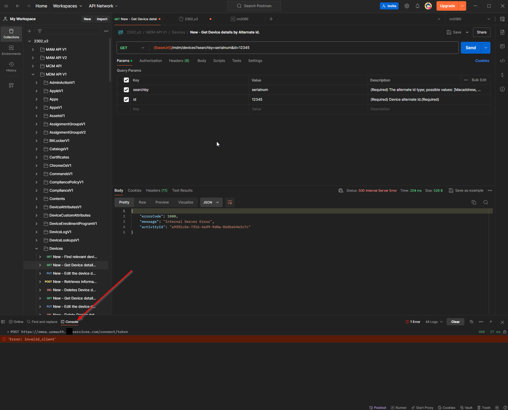

### Additional Considerations

Now that you know which API calls to use to reach our goal, you can proceed to the next step to automate the process if needed. Postman conveniently allows you to export these API calls into various languages, as shown here.

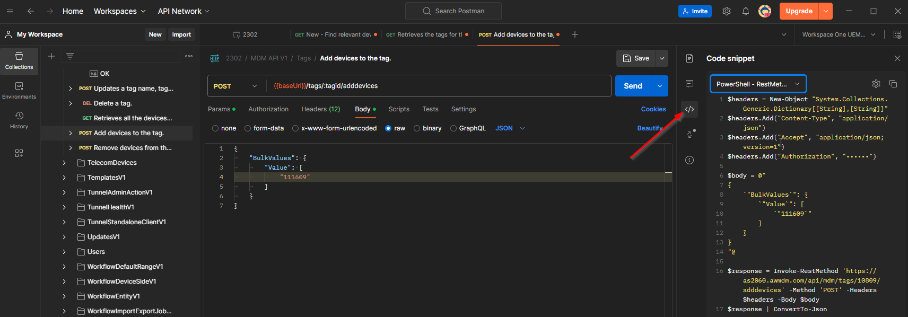

Below is a real-world example of a script built for a customer. In short, it does the following things:

1. Retrieves all available tags in a specific Organization Group.
2. Retrieves all devices enrolled in the last X number of days.
3. Checks the first five characters of the Asset Number that the user entered during enrollment.
4. If it can find a tag that matches these 5 characters, that tag is assigned. If no match is found, a fallback tag is assigned.

These tasks that are not natively available in the Workspace ONE UEM console, but can easily be tackled using the provided Postman collection.

```js
################################################################################## Parameters

#################################################################################

# Define the OAuth endpoint, client ID, and client secret

$tokenUrl = "<provide Token URL>"

$clientId = "<provide Oauth Client ID>"

$clientSecret = "<provide Oauth Client Secret>"

$api_server_url = "<provide API Server hostname (asXXXX)>"

$aw_tenant_code = "<provide API key>"

$LocationGroupID = "<LG_ID>"

$numberOfDays = 1

 

#################################################################################

# request token

#################################################################################

# Define the OAuth request parameters

$body = @{

    grant_type    = "client_credentials"

    client_id     = $clientId

    client_secret = $clientSecret

}

 

# Make the OAuth token request

$oauth_token = Invoke-RestMethod -Uri $tokenUrl -Method Post -ContentType "application/x-www-form-urlencoded" -Body $body

 

#################################################################################

# Get available tags in given Organization group

#################################################################################

$headers = New-Object "System.Collections.Generic.Dictionary[[String],[String]]"

$headers.Add("Accept", "application/json;version=1")

$headers.Add("Authorization", "Bearer $($oauth_token.access_token)")

 

$availableTags = Invoke-RestMethod "https:// $api_server_url.awmdm.com/api/system/groups/$LocationGroupID/tags" -Method 'GET' -Headers $headers

 

# Store tags in a dictionary for fast lookup

$tagDict = @{}

foreach ($tag in $availableTags.Tags) {

    $tagDict[$tag.TagName] = $tag

}

 

# Add the special tag for empty or invalid asset numbers

$emptyOrInvalidTagName = "emptyorinvalidassetnumber"

$emptyOrInvalidTagID = $tagDict[$emptyOrInvalidTagName].Id

 

#################################################################################

# get devices enrolled in the last X days

#################################################################################

$startDate = (Get-Date).AddDays(-$numberOfDays).ToString("yyyy/MM/dd")

 

$recentlyEnrolled = Invoke-RestMethod "https:// $api_server_url.awmdm.com/api/system/users/enrolleddevices/search?enrolledsince=$startDate" -Method 'GET' -Headers $headers

 

#################################################################################

# Match AssetNumber (first 5 characters) with TagName and assign tag

#################################################################################

 

foreach ($device in $recentlyEnrolled.EnrolledDeviceInfoList) {

    $tagID = $null

    if (![string]::IsNullOrEmpty($device.AssetNumber) -and $device.AssetNumber.Length -ge 5) {

        $assetNumberPrefix = $device.AssetNumber.Substring(0, 5)

        if ($tagDict.ContainsKey($assetNumberPrefix)) {

            $tagID = $tagDict[$assetNumberPrefix].Id

        }

    }

   

    # If no matching tag found, use the emptyOrInvalidTagID

    if ($null -eq $tagID) {

        $tagID = $emptyOrInvalidTagID

    }

 

    $deviceID = $device.DeviceID

 

    $body = @{

        BulkValues = @{

            Value = @($deviceID)

        }

    } | ConvertTo-Json -Compress

 

    $response = Invoke-RestMethod "https:// $api_server_url.awmdm.com/api/mdm/tags/$tagID/adddevices" -Method 'POST' -Headers $headers -Body $body

 

    # Output the response for each device

    $response | ConvertTo-Json

}
```